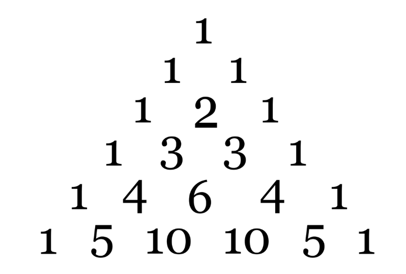

# 📋 나무 조각
- Link<br>
https://www.acmicpc.net/problem/1010
- 풀이 날짜<br>
2025.08.21

## 🔎 문제 탐색하기

### 입력값
- 첫째 줄<br>
T: 몇 개의 Test case를 진행할 것인지

- 둘째 줄부터 T+1째 줄<br>
한 줄에 공백으로 구분된 N과 M<br>
N: 강 서쪽에 있는 사이트의 개수<br>
M: 강 동쪽에 있는 사이트의 개수<br>
(0 < N ≤ M < 30)

### 출력값
- 각각의 Test case에 대해 다리를 지을 수 있는 경우의 수<br>
줄 바꿈으로 Test case 구분

### 생각해 본 방법
강을 기준으로 서쪽 사이트와 동쪽 사이트를 연결해 다리로 만들기<br>
한 사이트에는 한 개의 다리만 연결될 수 있다.<br>
다리끼리는 교차될 수 없다.<br>
다리를 지을 수 있는 경우의 수 구하기<br>

서쪽 사이트의 수(N)가 동쪽 사이트의 수(M)보다 더 적기 때문에 서쪽 사이트 수만큼 다리를 만들 수 있다.<br>
이때, 순서는 상관 없이 동쪽 사이트에서 M개 중에 N개를 고르고 교차되지 않도록 다리를 이어주면 된다.

- 조합 사용<br>
M개 중 N개를 고르는 경우의 수 = 이항계수 C(M, N)

- 파스칼 삼각형<br>
<br>
C(n, r) = C(n-1, r-1) + C(n-1, r)

## 📝 코드 설계하기

1. Test case의 수 T를 입력받는다. O(1)
2. T번만큼 반복하며 아래 과정을 수행한다. O(T)
3. 각 Test case에서 N(서쪽 사이트)와 M(동쪽 사이트)을 입력받는다. O(1)
4. combination()을 호출해 C(M, N)을 계산한다. O(MN)
5. 반환된 값을 출력한다. O(1)

총 시간 복잡도 = O(TMN)

## ✅ 정답 코드
```java
import java.io.*;
import java.util.*;

public class Main {
  public static void main(String[] args) throws IOException {
    BufferedReader br = new BufferedReader(new InputStreamReader(System.in)); // 한 줄 단위로 입력값 입력 받음

    int T = Integer.parseInt(br.readLine()); // Test case의 수 T를 입력받는다.
    
    for (int t = 0; t < T; t++) { // Test case의 수만큼 반복
      StringTokenizer st = new StringTokenizer(br.readLine()); // 공백을 기준으로 잘라주는 st 생성
      int N = Integer.parseInt(st.nextToken()); // 서쪽 사이트 개수 입력받기
      int M = Integer.parseInt(st.nextToken()); // 동쪽 사이트 개수 입력받기

      System.out.println(combination(M, N)); // combination 함수를 통해 경우의 수 출력
    }
  }

  // m개 중에서 n개를 고르는 조합 C(m, n)을 계산하는 함수
  public static int combination(int m, int n) {
    int[][] comb = new int[m+1][n+1]; // 조합 값 저장하는 2차원 배열

    for (int i = 0; i < m+1; i++) { // 0행 ~ m행까지 계산
      comb[i][0] = 1; // 0개를 선택하는 경우는 항상 1
      int maxJ = Math.min(i, n); // 현재 행에서 계산할 최대 열 번호

      if (i <= n) comb[i][i] = 1; // i개 중 i개 모두 선택하는 경우는 항상 1
      
      for (int j = 1; j < maxJ+1; j++) {
        if (j == i) continue; // 위의 조건문에서 처리했으므로 continue
        comb[i][j] = comb[i-1][j-1] + comb[i-1][j]; // 파스칼 법칙 적용
      }
    }
    return comb[m][n];
  }
}
```

## 🔧 시도 회차 수정 사항
### 1회차
- 시간 초과로 실패함<br>
```java
// 변경 전 / O(2^n)
public static int combination(int n, int r) {
  if (n == r || r == 0) {
    return 1;
  } else {
    return combination(n-1, r-1) + combination(n-1, r);
  }
}

// 변경 후 / O(mn)
public static int combination(int m, int n) {
  int[][] comb = new int[m+1][n+1]; // 조합 값 저장하는 2차원 배열

  for (int i = 0; i < m+1; i++) { // 0행 ~ m행까지 계산
    comb[i][0] = 1; // 0개를 선택하는 경우는 항상 1
    int maxJ = Math.min(i, n); // 현재 행에서 계산할 최대 열 번호

    if (i <= n) comb[i][i] = 1; // i개 중 i개 모두 선택하는 경우는 항상 1
    
    for (int j = 1; j < maxJ+1; j++) {
      if (j == i) continue; // 위의 조건문에서 처리했으므로 continue
      comb[i][j] = comb[i-1][j-1] + comb[i-1][j]; // 파스칼 법칙 적용
    }
  }
  return comb[m][n];
}
```
재귀 호출을 통한 조합 계산을 파스칼 삼각형 기반의 DP 방식으로 시간을 줄였다.<br>
O(2^n) -> O(mn)