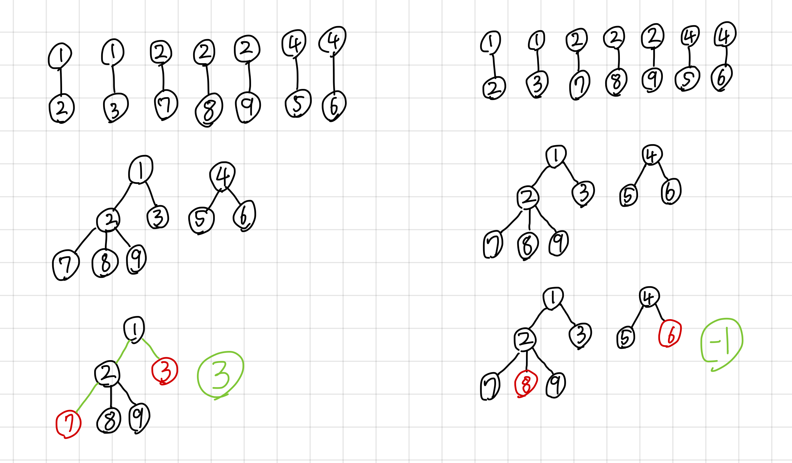

# 📋 촌수계산
- Link<br>
https://www.acmicpc.net/problem/2644
- 풀이 날짜<br>
2025.08.26

## 🔎 문제 탐색하기


트리구조를 통해 가족 관계를 구성한다.<br>
첫째 줄에 주어지는 전체 사람의 수는 노드의 수를 의미한다.<br>
셋째 줄에 주어지는 관계의 개수는 간선의 수를 의미한다.<br>
또한, 둘째 줄에 주어지는 서로 다른 두 사람의 촌수는 간선의 개수를 의미한다.

### 입력값
- 첫째 줄<br>
n: 전체 사람의 수 (1 ≤ N ≤ 100)

- 둘째 줄<br>
공백으로 구분된 촌수를 계산해야 하는 서로 다른 두 사람의 번호

- 셋째 줄<br>
m: 부모 자식들 간의 관계의 개수

- 넷째 줄부터 m개의 줄<br>
공백으로 구분된 부모 자식간의 관계를 나타내는 두 번호<br>
x: 부모 번호<br>
y: 자식 번호

### 출력값
- 둘째 줄에서 입력받은 두 사람의 촌수를 나타내는 정수 출력

### 생각해 본 방법
두 사람 사이의 촌수를 구하는 것이기 때문에 그래프에서 두 노드 사이의 최단 거리를 구하는 문제다.<br>
방향이 없고, 간선의 가중치가 1이다.<br>
최단 거리 탐색을 위해 큐를 사용한 BFS를 구현한다.

## 📝 코드 설계하기
1. 전체 사람 수 n을 입력한다. O(n)
2. 촌수 계산할 두 사람 p1, p2를 입력한다. O(1)
3. 관계 개수 m을 입력한다. O(1)
4. 관계 입력한다. O(m)
5. BFS 탐색 실행한다. O(n+m)
6. 두 사람의 촌수를 출력한다. O(1)

총 시간 복잡도 = O(n+m)

## ✅ 정답 코드
```java
import java.io.*;
import java.util.*;

public class Main {

  static int n; // 전체 사람 수 
  static int person1, person2; // 촌수를 구할 두 사람
  static int m; // 관계 개수
  static List<List<Integer>> relation; // 관계 그래프
  static boolean visited[]; // 방문 여부 배열
  static int answer = -1;

  public static void bfs(int start, int target) { // BFS
    Deque<int[]> queue = new ArrayDeque<>(); // [노드, 현재 촌수] 저장하는 큐
    queue.add(new int[]{start, 0}); // 시작값 초기화
    visited[start] = true;

    while (!queue.isEmpty()) {
      int[] current = queue.poll(); // 큐에서 값 꺼내기
      int n = current[0]; // 현재 노드
      int d = current[1]; // 현재까지 촌수

      if (n == target) { // 목표에 도달했을 경우
        answer = d;
        return;
      }

      for (int v : relation.get(n)) { // 인접 노드 확인
        if (!visited[v]) {
          visited[v] = true;
          queue.add(new int[]{v, d+1}); // 촌수 +1 하고 큐에 추가
        }
      }
    }
  }

  public static void main(String[] args) throws IOException {
    BufferedReader br = new BufferedReader(new InputStreamReader(System.in)); // 한 줄 단위로 입력값 입력 받음

    n = Integer.parseInt(br.readLine()); // 전체 사람 수 입력
    relation = new ArrayList<>(n+1);
    for (int i = 0; i < n+1; i++) {
      relation.add(new ArrayList<>()); // 각 정점에 리스트 생성
    }
    visited = new boolean[n+1];

    StringTokenizer st = new StringTokenizer(br.readLine()); // 공백을 기준으로 잘라주는 st 생성
    // 촌수 계산할 두 사람 입력
    person1 = Integer.parseInt(st.nextToken());
    person2 = Integer.parseInt(st.nextToken());

    m = Integer.parseInt(br.readLine()); // 관계 개수 입력

    for (int i = 0; i < m; i++) { // 관계 입력
      st = new StringTokenizer(br.readLine());
      int parent = Integer.parseInt(st.nextToken());
      int child = Integer.parseInt(st.nextToken());
      relation.get(parent).add(child);
      relation.get(child).add(parent);
    }

    bfs(person1, person2);

    System.out.println(answer);
  }
}
```