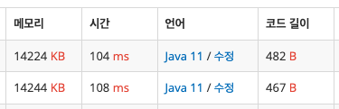

# 📋 피보나치 수2
- Link<br>
https://www.acmicpc.net/problem/2748
- 풀이 날짜<br>
2025.08.19

## 🔎 문제 탐색하기

### 입력값
- 첫째 줄<br>
n<br>
몇 번째 피보나치 수를 구할 것인지<br>
(n ≤ 90)

### 출력값
- n 번째 피보나치 수

### 생각해 본 방법
반복문을 통해 i-2번째 수와 i-1번째 수를 더해 i번째 수를 구한다.<br>
for문을 2부터 시작해 구해지는 수의 자리를 의미하게 한다.<br>

n번째까지의 수를 전부 출력하는 것이 아니기 때문에 배열에 따로 저장하지 않고 이전 두 수와 답을 저장하는 변수만 있으면 될 것 같다.

## 📝 코드 설계하기
### 2차원 배열 사용
1. 문제의 Input을 받는다. O(1)
2. 두개의 변수를 0번째와 1번째 수인 0과 1로 초기화한다. O(1)
3. 2부터 n+1까지 for문을 통해 이전의 두 수를 더하는 방식으로 다음 수를 계산한다. O(n)
4. 반복문이 끝난 후 마지막에 저장된 값을 출력한다. O(1)

총 시간 복잡도 = O(n)

## 🔧 시도 회차 수정 사항
### 1회차
- class의 이름을 Main이 아닌 다른 것으로 해서 컴파일 에러가 남<br>
→ Main으로 수정

### 2회차
```java
// 기존 코드
int ppreNum = 0;
int preNum = 1; 
int answer = 0;
```
```java
// 수정한 코드
long ppreNum = 0;
long preNum = 1; 
long answer = (n == 0) ? 0 : 1;
```
- n이 커지면서 int의 범위를 벗어나 오버플로우 발생<br>
  int 타입을 long 타입으로 변경해 더 큰 수를 저장할 수 있게 했다.<br>

- for문을 2부터 시작하면서 생기는 반례를 생각하지 못함<br>
answer를 0으로 두고 for문을 2로 시작했다.<br>
n=0, n=1일 때 for문으로 answer를 구하지 않고 초기화한 값인 0을 출력한다.<br>
이때, n=1일 때 1이 출력되어야 하는데 초기화한 값인 0을 출력했다.<br>
삼항연산자를 통해 n=0과 n=1일 때 각각 answer를 0과 1로 초기화할 수 있게 수정했다.

## ✅ 정답 코드
- 변수만 사용
```java
import java.io.*;

public class Main {
  public static void main(String[] args) throws IOException {

    BufferedReader br = new BufferedReader(new InputStreamReader(System.in)); // 한 줄 단위로 입력값 입력 받음

    int n = Integer.parseInt(br.readLine()); // n 번째 피보나치 수를 구할 것인지 받음

    long ppreNum = 0; // i-2번째 수 | 즉, 0번째 수를 0으로 초기화
    long preNum = 1; // i-1번째 수 | 즉, 1번째 수를 1로 초기화
    long answer = (n == 0) ? 0 : 1; // i 번째 수 | 즉, 답인 n번째 수 | 아래의 for문이 2부터 시작하기 때문에 n = 0일 때 0, n = 1일 때 1로 초기화

    for (int i = 2; i < n+1; i++) { // n 번째 수를 구하기 위해 초기 값을 준 0번째, 1번째를 건너뛰고 2부터 시작
      answer = ppreNum + preNum; // 이전 두 수를 더해 다음 수를 구함
      ppreNum = preNum; // 다음 수의 계산을 위해 수를 앞으로 한 칸 당김
      preNum = answer; // 다음 수의 계산을 위해 수를 앞으로 한 칸 당김
    }

    System.out.println(answer);
  }
}
```

- 배열 사용
```java
import java.io.*;

public class Main {
  public static void main(String[] args) throws IOException {

    BufferedReader br = new BufferedReader(new InputStreamReader(System.in)); // 한 줄 단위로 입력값 입력 받음

    int n = Integer.parseInt(br.readLine()); // n 번째 피보나치 수를 구할 것인지 받음

    if (n < 2) { // n이 0 또는 1일 경우
      System.out.println(n);
      return; // 종료
    }

    long[] nums = new long[n+1]; // 0번째 숫자도 포함하기 때문에 n+1 크기의 배열 생성
    nums[0] = 0; // 0번째 0으로 초기화
    nums[1] = 1; // 1번째 1로 초기화

    for (int i = 2; i < n+1; i++) {
      nums[i] = nums[i-2] + nums[i-1]; // 이전의 두 수를 더해 i번째에 저장
    }

    System.out.println(nums[n]);
  }
}
```

- 제출 결과<br>

<br>
아래: 변수만 사용<br>
위: 배열 사용

제출해본 결과 실행 시간에서 큰 차이가 없었다. 시간 복잡도가 똑같이 O(n)이라 그런 것 같다.<br>
배열로 바꾸면서 for문은 더 간단해지고 의도가 잘 보이지만 n을 받고 나서 조건문을 하나 더 추가했어야 됐다.
```java
if (n < 2) {
  System.out.println(n);
  return;
}
```